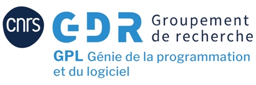

## Bienvenue

L'école a pour objectif de rassembler les jeunes chercheur·se·s dans les thématiques logicielles, en première ou deuxième année de thèse, pendant une semaine à deux semaines. C'est l'occasion de découvrir un ensemble de thèmes de recherche de la communauté du logiciel, domaine vaste jamais abordé dans un unique master. Les intervenant·e·s réalisent des cours et des travaux pratiques variés et de grande qualité.

### Organisation

L'école est organisée chaque année par une équipe différente. Les intervenant·e·s sont choisi·e·s dans la communauté francophone, en collaboration entre l'équipe locale et la direction de l'école. 

### Dernières éditions

* 2021 : édition "mode dégradé" en distanciel, pendant les journées du GDR (Semaine du 14 juin 2021). [édition 2021 TBA](_pages/ejcp21/index.html)
* 2020 : édition annulée (Nantes, en 2022)
* 2019 à [Strasbourg](http://ejcp2019.icube.unistra.fr/)
* 2018 à [Lyon](https://ejcp2018.sciencesconf.org/)
* 2017 à [Toulouse](http://ejcp2017.enseeiht.fr/)
* 2016 à [Lille](http://ejcp2016.univ-lille1.fr/)
* 2015 à [Nancy](http://ejcp2015.inria.fr/)
* 2014 à [Rennes](http://ejcp2014.inria.fr/)
* 2013 à [Dinard/Rennes](http://ejcp2013.inria.fr/)

